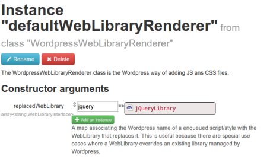

Scripts and styles integration
==============================

By default, Wordpress uses the [`wp_enqueue_style`](http://codex.wordpress.org/Function_Reference/wp_enqueue_style) 
and [`wp_enqueue_script`](http://codex.wordpress.org/Function_Reference/wp_enqueue_script) functions to handle
CSS and JS files.

In Mouf, on the other hand, scripts and styles are handled using 
[WebLibraries](http://mouf-php.com/packages/mouf/html.utils.weblibrarymanager/README.md).

When you use Moufpress, you can use both techniques to add JS and CSS files to your pages.

Using *Web libraries* in Moufpress
----------------------------------

We will not cover the use of web libraries in this documentation. If you want to learn how to use
we libraries, please refer to the [web libraries documentation](http://mouf-php.com/packages/mouf/html.utils.weblibrarymanager/README.md).

Internals
---------

Internally, the Moufpress plugin is replacing the default renderer that comes with the `WebLibrary` system by
a custom renderer that is tailored specifically for Wordpress. In Mouf, you can search for the 
`defaultWebLibraryRenderer` instance, and you will see that this instance points to a `WordpressWebLibraryRenderer`
class. This means that the `WebLibrary` system will use Wordpress to render JS and CSS files. 

Handling duplicates
-------------------

At some point, you might have a Wordpress plugin that declares a JS script in Wordpress and a Mouf package
that declares the same JS script in Mouf. Of course, you want to avoid loading the JS script twice.

Moufpress let's you do this.

In Mouf UI, open the `defaultWebLibraryRenderer` instance page.

As you can see, there is a `replacedWebLibrary` property.
This is a map where the key is the name of the script as declared in Wordpress and the value is the
`WebLibrary` that will replace it.

By default, you will notice that Moufpress is replacing the `jquery` script with its own version of the script.